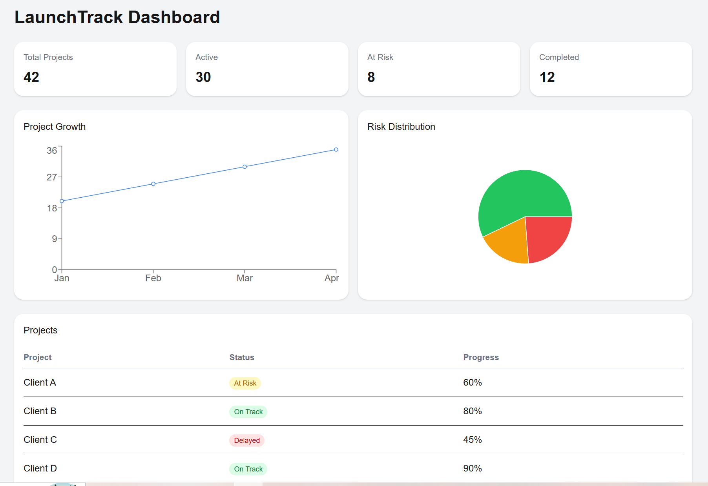

# 🚀 LaunchTrack Dashboard

A frontend analytics dashboard for visualizing implementation delivery data such as project status, risks, and progress.

## 🎯 Purpose

Designed to help implementation managers quickly understand:

* Project health
* Risk distribution
* Delivery trends

## ⚡ Features

* Stats overview (projects, risks, completion)
* Line chart (project trends)
* Pie chart (risk distribution)
* Project table with status indicators

## 🛠 Tech Stack

* Next.js
* React
* Tailwind CSS
* Recharts

## 📸 Screenshot

## 🧠 Note

This dashboard uses mock data for visualization. In a real-world setup, it would connect to a backend API (e.g., LaunchTrack system).
